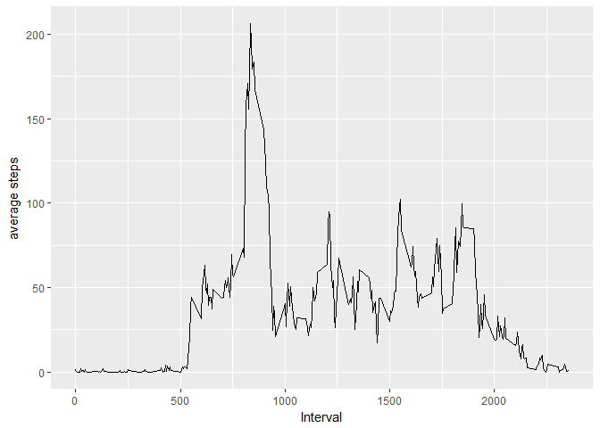

# Reproducible Research: Peer Assessment 1

```r
library(ggplot2)
```

## Loading and preprocessing the data


```r
unzip("activity.zip" )
data = read.csv("activity.csv")
```

## What is mean total number of steps taken per day?

```r
stepsByDay = tapply(data$steps, data$date, sum)

meanStepsByDay = mean(stepsByDay, na.rm = T)

meadianStepsByDay = median(stepsByDay, na.rm = T)

qplot(stepsByDay,xlab='Total steps per day', ylab='Frequency (binwith 500)', binwidth=500)
```

```
## Warning: Removed 8 rows containing non-finite values (stat_bin).
```

<!-- -->

* Mean: 1.0766189\times 10^{4}
* Median: 10765


## What is the average daily activity pattern?


```r
stepsByInterval = aggregate(steps ~ interval, data, mean)

ggplot(data = stepsByInterval, aes(x=interval, y=steps)) + geom_line() + xlab("Interval") + ylab("average steps")
```

<!-- -->

```r
max = which.max(stepsByInterval$steps)

stepsByInterval[max,1]
```

```
## [1] 835
```
The 5-minute interval that contains, on average across all the days in the dataset, the maximum number of steps is 835

## Imputing missing values


## Are there differences in activity patterns between weekdays and weekends?
