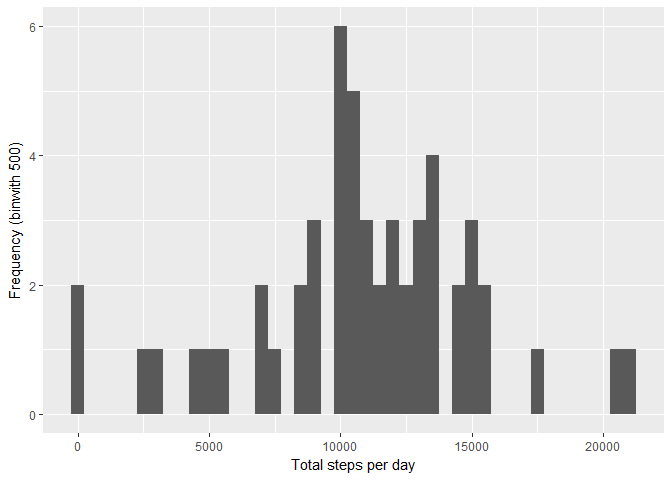

# Reproducible Research: Peer Assessment 1

```r
library(ggplot2)
library(Hmisc)
```

```
## Loading required package: lattice
```

```
## Loading required package: survival
```

```
## Loading required package: Formula
```

```
## 
## Attaching package: 'Hmisc'
```

```
## The following objects are masked from 'package:base':
## 
##     format.pval, round.POSIXt, trunc.POSIXt, units
```

```r
options(scipen=999)
```

## Loading and preprocessing the data


```r
unzip("activity.zip" )
data = read.csv("activity.csv")
```

## What is mean total number of steps taken per day?

```r
stepsByDay = tapply(data$steps, data$date, sum)

meanStepsByDay = mean(stepsByDay, na.rm = T)

meadianStepsByDay = median(stepsByDay, na.rm = T)

qplot(stepsByDay,xlab='Total steps per day', ylab='Frequency (binwith 500)', binwidth=500)
```

```
## Warning: Removed 8 rows containing non-finite values (stat_bin).
```

<!-- -->

- Mean: 10766.1886792
- Median: 10765


## What is the average daily activity pattern?


```r
stepsByInterval = aggregate(steps ~ interval, data, mean)

ggplot(data = stepsByInterval, aes(x=interval, y=steps)) + geom_line() + xlab("Interval") + ylab("average steps")
```

<!-- -->

```r
max = which.max(stepsByInterval$steps)
```
The 5-minute interval that contains, on average across all the days in the dataset, the maximum number of steps is 835

## Imputing missing values


```r
nas = sum(!complete.cases(data))
```

The number of row with NAS is 2304


```r
imputedData = data
imputedData$steps = impute(imputedData$steps, fun=mean)


imputedStepsByDay = tapply(imputedData$steps, imputedData$date, sum)

imputerdMeanStepsByDay = mean(imputedStepsByDay, na.rm = T)

imputedMeadianStepsByDay = median(imputedStepsByDay, na.rm = T)

meanDiff = imputerdMeanStepsByDay-meanStepsByDay

medianDiff = imputedMeadianStepsByDay - meadianStepsByDay

totalDiff = sum(imputedData$steps) - sum(data$steps, na.rm=T)  
  

qplot(imputedStepsByDay,xlab='Total steps per day', ylab='Frequency (binwith 500)', binwidth=500)
```

<!-- -->

- Mean: 10766.1886792
- Median: 10766.1886792

The difference between the mean of imputed and original data is 0  
The difference between the meadian of nimputed and original data is 1.1886792  
The difference of the sum of total steps from imputed and original data is 86129.509434  


## Are there differences in activity patterns between weekdays and weekends?


```r
imputedData$isWeekDay = as.factor(ifelse(as.POSIXlt(imputedData$date)$wd %in% seq(1,5), "weekday", "weekend"))

stepsByIntervalImputed = aggregate(steps ~ interval + isWeekDay, imputedData, mean)

ggplot(data = stepsByIntervalImputed, aes(x=interval, y=steps)) + 
    geom_line() + 
    facet_grid(isWeekDay ~ .) +
    xlab("interval") + 
    ylab("avarage  steps")
```

<!-- -->
